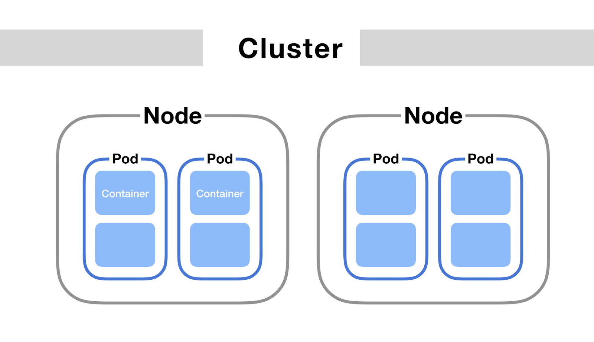
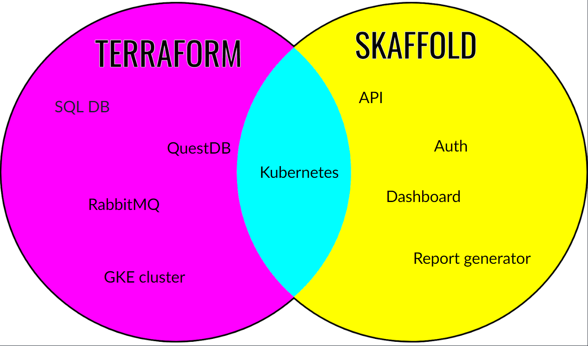

# Introduction to local deployment tools.

#### These are slightly written up (but still messy) notes that I used during the presentation. The tools you will need to run these are described in the onboarding setup wiki doc, along with more in depth info on lots of these topics.

## Just
justfile is a convenient command runner tool, lets us essentially alias: long complex commands, multiple commands and easily populate commands.

## Docker
docker is a container engine that allows for containers to be created and run using a virtualised OS

### Terminology
- Docker : The container engine that creates and manages containers.
- Dockerfile: A file containing a list of instructions to build an image.
- image: A layered collection of file system changes, with each layer being created from an instruction.
- container: A running instance of an image.

### Benefits:
 - Repeatable - A docker image can be easily downloaded and run by any container engine, and the container will act the same across different supported architectures.
 - isolated environments - Containers run using the kernel, but otherwise are completely isolated from the rest of the host operating system.
 - roll back easily in kubernetes - As images are tagged with a version, and they are repeatable, we can easily roll back any containers that cause issues and quickly have the previous version running.

### Useful docker commands:
- run container -           `docker run <IMAGE> <ARGS>`
- connect into a container -    `docker run -it <IMAGE> /bin/bash`
- List all images - `docker ps -a`
- Wipe __ALL__ docker containers, images, networks, caches etc - `docker system prune -a`

## Kubernetes

Kubernetes runs containers for us instead of docker - they both use containerd under the hood to actually run the containers, and they are essentially just an interface to containerd.
Kubernetes is an orchestration tool - it lets you define and control when/how/what containers run across scalable clusters of VMs (amongst other stuff: health checks, self-healing, load balancing)

- Top: Cluster - A collection of VMs called nodes.
  - On Nodes, you can deploy workloads, services, PVCs, storage, config and other kubernetes infrastructure. Example workloads include:
      - deployment: Creates just a simple pod
      - stateful set: Used when the pod needs to keep a state - provides guarantees about the ordering and uniqueness of these Pods on creation/deletion.
      - daemon set: Creates exactly one pod per node
      - jobs/cron jobs: Create jobs that run once and then die, or jobs that are run at regular intervals.

All these workload types create pods - a group of containers that share storage and network and are managed by the workload.

Kubernetes has the idea of namespaces - an area of objects with an identifier to keep them separate from other instances of pods.

`Kubectl` is the CLI tool to communicate with kubernetes

## Skaffold

Skaffold is a tool that focuses on building, pushing and deploying applications to kubernetes
- define the entire k8s deploy in one place
- context aware, allowing for profiles to replace variables/flags etc
- automated deployments on source code change, testing, remote file syncing

In the demo, we are using kubectl in skaffold to upload to kubernetes, but in the real config we use `helm`.
`Helm` is a kubernetes application manager - Think apt or homebrew and contains preconfigured kubernetes definitions.

## Terraform

Terraform is an infrastructure as code tool
- you define your infrastructure and how it interacts with other pieces of the infrastructure.
- Currently, we use HCL (hashicorp configuration language) but you are able to use go/python/TS to define your state.
- Uses providers that can be written (usually by the company who runs the thing being interfaced with) to interface with anything. These providers are uploaded to the tf registry and the docs explain how they are used.
- TF is a state based management system, storing the state of the remote environment and the resources declared in your TF configuration.

 ---
 _These need to be run using the actual code in the repo, as there is no terraform demo._

---
Once the code is written, you create a plan

`just tf plan`

The plan describes the infrastructure that will be created/updated/destroyed/viewed based on the current infrastructure and the changes made in the configuration

Once the plan is checked, you apply

`just deploy_working_env`

The apply will start making the changes that the plan had in.

